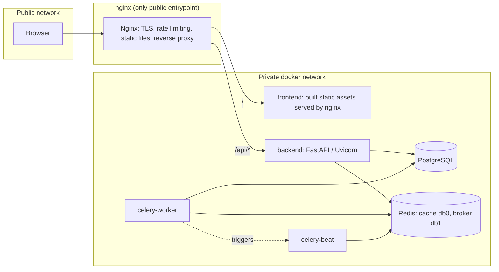
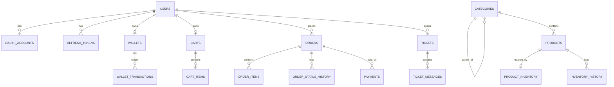
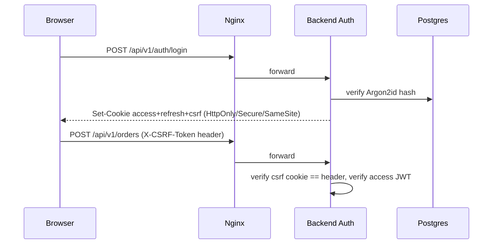

# معماری فروشگاه الکترونیک — Architecture & Threat Model

Status: living document, updated as phases land. This is the Phase 1 deliverable for the
Persian electronics e-commerce platform. It fixes the design decisions that later phases
implement against, so that code across phases stays consistent instead of drifting.

## 1. System Architecture

Modular monolith. One FastAPI process (horizontally scalable behind Nginx), one Postgres
instance (source of truth), one Redis instance (cache + Celery broker/result backend, separate
logical DBs), Celery worker + beat for background jobs. No microservices, no message broker
beyond Redis, no search engine beyond Postgres `pg_trgm`/`unaccent`.



Only Nginx is published on the host. Postgres, Redis, backend and Celery stay on the internal
Docker network (`internal: true` where they don't also need the shared edge network).

Layering inside `backend/app`, top to bottom, one-way dependency:

```
api/            FastAPI routers — request/response only, no business logic
schemas/        Pydantic v2 DTOs (per-operation, never reuse ORM models as input schemas)
services/       business logic, transaction boundaries, orchestration
repositories/   data access (SQLAlchemy queries), no business rules
models/         SQLAlchemy ORM models
security/       auth, RBAC, password hashing, JWT, CSRF
tasks/          Celery tasks (thin — call services)
integrations/   ZarinPal client, Google OAuth client, storage abstraction
common/         shared errors, pagination, idempotency, request context
```

Routers depend on services; services depend on repositories; nothing below `services/`
imports FastAPI. This keeps services independently testable and keeps routes free of
business logic per the project's own ground rules.

## 2. Repository Tree

```
electronics-shop/
├── backend/
│   ├── app/
│   │   ├── main.py
│   │   ├── api/v1/{auth,users,categories,products,inventory,cart,orders,
│   │   │              payments,wallet,tickets,admin,reports,health}.py
│   │   ├── core/          # settings, logging, request-id middleware
│   │   ├── db/             # session, base, engine
│   │   ├── modules/{auth,users,catalog,inventory,cart,orders,payments,
│   │   │              wallet,tickets,admin,reports,audit,notifications}/
│   │   │     each module: models.py, schemas.py, service.py, repository.py, router.py
│   │   ├── security/       # jwt, password hashing, rbac, csrf, oauth
│   │   ├── tasks/          # celery app + task modules
│   │   ├── integrations/   # zarinpal.py, google_oauth.py, storage.py
│   │   └── common/         # errors, pagination, idempotency, deps
│   ├── alembic/
│   ├── tests/
│   ├── scripts/seed.py
│   ├── pyproject.toml
│   └── Dockerfile
├── frontend/
│   ├── src/{pages,admin,components,features,api,stores,hooks,lib}
│   ├── public/
│   ├── package.json
│   └── Dockerfile
├── nginx/{nginx.conf, conf.d/}
├── docs/
├── scripts/
├── docker-compose.yml
├── docker-compose.prod.yml
├── .env.example
├── .gitignore
├── Makefile
└── README.md
```

## 3. Database Model (core entities)



Key tables (fields trimmed to the non-obvious ones):

- `users` — `id UUID pk`, `email unique`, `username unique`, `hashed_password nullable`
  (null for OAuth-only accounts), `role enum(customer,support,admin,super_admin)`,
  `is_active`, `is_verified`, timestamps.
- `oauth_accounts` — `unique(provider, provider_user_id)`. Never auto-links to an existing
  local account by email; linking is an explicit authenticated action.
- `refresh_tokens` — stores a hash of the token, `family_id`, `revoked_at`, `replaced_by_id`.
  Reuse of a revoked token revokes the whole family (breach detection).
- `categories` — `parent_id` self-FK nullable, `check(parent_id <> id)`, `sort_order`.
  Cycle prevention is enforced in the service layer (ancestor walk inside the same
  transaction as the move), not just at the DB level.
- `products` — `sku unique`, `slug unique`, `price NUMERIC(12,0)`, `discount_price NUMERIC(12,0) nullable`,
  `specifications JSONB`, `images JSONB`. All money columns are `NUMERIC`, never `float`.
- `product_inventory` — `stock_total`, `stock_reserved`. Available = `stock_total - stock_reserved`.
  Mutated only via `SELECT ... FOR UPDATE`.
- `inventory_history` — append-only log of every stock mutation with `change_type`,
  `reference_type/id`, `actor_id`.
- `carts` / `cart_items` — one cart per user, `unique(cart_id, product_id)`.
- `idempotency_keys` — `unique(user_id, operation, key)`, `request_hash`, `status`,
  `response_body JSONB`, `response_status`, `expires_at`.
- `orders` — `status enum`, immutable per-item snapshots live on `order_items`
  (`product_name_snapshot`, `sku_snapshot`, `unit_price_snapshot`).
- `order_status_history` — every transition logged with actor and timestamp.
- `payments` — `authority unique`, `status enum(initiated,pending,verified,failed)`,
  `raw_gateway_response JSONB`. Verification does a conditional
  `UPDATE ... WHERE status='initiated'` so a second callback is a no-op.
- `wallets` / `wallet_transactions` — ledger-style; `wallets.balance` is a maintained
  cache of the ledger sum, only ever updated in the same transaction as the ledger insert,
  under `SELECT ... FOR UPDATE` on the wallet row. `wallet_transactions.idempotency_key`
  is unique when present.
- `tickets` / `ticket_messages` — `last_customer_response_at` drives the 24h auto-close job.
- `audit_logs` — append-only, `actor_id`, `action`, `resource_type/id`, `metadata JSONB`.

## 4. API Design

`/api/v1/{auth,users,categories,products,cart,orders,payments,wallet,tickets,admin/*,reports,health}`.
Admin endpoints live under `/api/v1/admin/...` and require role + explicit permission, never
just "the URL is different." Every list endpoint takes `page`, `page_size` (capped, default
20/max 100), an explicit sortable-column allowlist, and documented filters.

Errors always come back as:
```json
{"error": {"code": "PRODUCT_NOT_FOUND", "message": "محصول موردنظر پیدا نشد.", "details": null, "request_id": "..."}}
```
never a raw traceback, SQL error, or file path.

## 5. Authentication Flow

Local: Argon2id-hashed passwords. Access token (JWT, ~15 min, minimal claims: `sub`, `role`,
`jti`, `exp`) and refresh token are both `HttpOnly`, `Secure`, `SameSite=Lax` cookies — not
`localStorage`. Refresh rotates on every use; the old token is marked `revoked_at` and points
to `replaced_by_id`; presenting an already-revoked token revokes the entire token family.
Because cookies drive state-changing requests, mutating endpoints require a `X-CSRF-Token`
header matching a non-HttpOnly `csrf_token` cookie (double-submit pattern).



## 6. Google OAuth2 / OIDC

Authorization Code + PKCE. `state` is a signed, short-TTL, server-issued value validated on
callback; the ID token's `iss`, `aud`, `exp`, and `nonce` are verified against Google's
published keys. If the verified email matches an existing **local** account, we do **not**
silently link — the user must log in locally first and link explicitly, closing the
email-confusion account-takeover path. Unmatched emails create a new user with
`is_verified=true` and no password.

## 7. Authorization / RBAC

Four roles, each mapped in code (not a DB table — the role set is small and fixed, a table
would be needless indirection) to an explicit permission set (`product.read`, `order.manage`,
`wallet.manage`, ...). A `require_permission("order.manage")` FastAPI dependency guards every
protected route. Object-level checks (ownership) are layered on top of role checks for
`/orders/{id}`, `/tickets/{id}`, `/wallet/{id}` etc. — a valid JWT is necessary but never
sufficient to read someone else's resource. UUID primary keys are used for external IDs but
are never treated as a secret/ACL by themselves.

## 8. Payment Architecture (ZarinPal Sandbox)

Stock is reserved at order-creation time (see §11), not at add-to-cart time.

```mermaid
sequenceDiagram
    participant B as Browser
    participant A as Backend
    participant DB as Postgres
    participant Z as ZarinPal
    B->>A: POST /orders (Idempotency-Key)
    A->>DB: BEGIN; lock product rows; reserve stock; insert order+items; COMMIT
    B->>A: POST /payments (order_id, Idempotency-Key)
    A->>Z: PaymentRequest(amount=order.total)
    Z-->>A: authority
    A->>DB: insert payment(status=initiated)
    A-->>B: redirect URL
    B->>Z: pay
    Z-->>A: GET /payments/callback?Authority&Status
    A->>DB: UPDATE payments SET status='pending' WHERE authority=... AND status='initiated'
    A->>Z: PaymentVerification(authority, amount=order.total from DB, never from callback)
    Z-->>A: verified + ref_id
    A->>DB: BEGIN; UPDATE payment WHERE status IN ('initiated','pending'); UPDATE order status=paid; commit reserved stock; COMMIT
```

A repeated callback or a manually replayed verification call finds the payment already
`verified`/`failed` and returns the stored result without re-calling the gateway — the
conditional `UPDATE ... WHERE status=...` is what makes verification idempotent, not an
in-memory lock.

## 9. Wallet Architecture

Ledger-first: every balance change is an insert into `wallet_transactions`; `wallets.balance`
is updated in the same transaction under a row lock. Deposits and admin adjustments require an
`Idempotency-Key`. No operation ever does a bare read-modify-write of the balance outside a
transaction.

## 10. Cart / Order Architecture

Cart belongs to an authenticated user (no anonymous cart — kept out of scope deliberately to
avoid merge-on-login edge cases that add complexity without teaching value here). Backend
recomputes unit price, discount, subtotal and total from the current `products` row at both
add-to-cart and checkout time; the frontend-submitted price is never trusted. Orders use an
explicit state machine (`pending → awaiting_payment → paid → processing → shipped → completed`,
plus `cancelled`, `payment_failed`, `refunded`) with a transition table rejecting invalid
moves (e.g. `completed → awaiting_payment`).

## 11. Idempotency Design

`Idempotency-Key` (client-generated UUID) required on: add-to-cart, checkout/order-create,
payment-init, payment-verify, wallet deposits/admin-adjustments. Row shape:
`(key, user_id, operation) unique`, `request_hash`, `status(pending|completed|failed)`,
`response_body`, `response_status`, `expires_at`. Flow: insert a `pending` row first (the
unique constraint means only one concurrent request wins the insert); losers of the race
get an `IntegrityError`, re-read the row, and return `409` if still pending or the stored
response if completed. A key reused with a different `request_hash` is rejected with `422`.
Implemented as a Postgres table, not Redis — this keeps the idempotency guarantee and the
business transaction on the same ACID boundary instead of two systems that can disagree.

## 12. Redis Caching Strategy

Cache-aside, versioned, enumerable keys — never `KEYS *`:
`home:v1`, `categories:tree:v1`, `products:featured:v1`, `products:popular:v1`,
`product:{slug}:v1`, `user:{id}:dashboard:v1`. Writes explicitly `DEL` the exact keys they
invalidate (product save → `product:{slug}:v1` + `products:featured:v1` if featured +
`home:v1`; category change → `categories:tree:v1` + `home:v1`). TTL (short, e.g. 5–15 min)
is a safety net for missed invalidations, not the primary consistency mechanism. Redis DB 0
is cache, DB 1 is the Celery broker/result backend — kept logically separate so a cache
flush can never touch job state.

## 13. Celery / Background Jobs

`celery-beat` schedules `tickets.auto_close_stale` every 10 minutes. It queries tickets
`WHERE status='waiting_for_customer' AND last_customer_response_at < now() - interval '24 hours'`
in bounded batches, and closes each with a conditional
`UPDATE tickets SET status='closed' WHERE id=:id AND status='waiting_for_customer'` — safe
under multiple workers/replicas because the guard is in the `WHERE` clause, not in Python.
Each closure writes an `audit_logs` row and a system `ticket_messages` entry. No per-ticket
scheduled task is ever created.

## 14. Nginx Architecture

Nginx is the only public entrypoint: serves the built frontend as static files, reverse
proxies `/api/*` to the backend, terminates rate limiting (`limit_req_zone` per-IP, tighter
zones on `/api/v1/auth/*`, `/api/v1/payments/*`, `/api/v1/tickets`), sets security headers
(`X-Content-Type-Options`, `Referrer-Policy`, `Content-Security-Policy`,
`Permissions-Policy`), and passes `X-Forwarded-For`/`X-Request-Id` upstream. HSTS is only
enabled once real TLS termination is confirmed in production config.

## 15. Admin Security Model

Same JWT/RBAC system as the storefront — `/admin` is a frontend routing convention, not a
security boundary. Every admin API additionally requires `role in (admin, super_admin)` plus
the specific permission for that action, and every mutating admin action writes an
`audit_logs` row. Schema includes nullable `mfa_secret`/`mfa_enabled` columns on `users` so
TOTP MFA can be added later without a migration on the hot path, but MFA enforcement itself
is out of scope for v1.

## 16. Key Database Indexes

`products(slug) unique`, `products(sku) unique`, `products(category_id)`, `products(is_active)`,
GIN trigram index on `products(name, description)` for search, `categories(parent_id)`,
`orders(user_id, created_at desc)`, `orders(status)`, `payments(authority) unique`,
`payments(order_id)`, `wallet_transactions(wallet_id, created_at desc)`,
`idempotency_keys(user_id, operation, key) unique`, `tickets(status, last_customer_response_at)`,
`refresh_tokens(user_id)`, `refresh_tokens(family_id)`.

## 17. Transaction Boundaries

Single DB transaction per: order creation + stock reservation; payment verification + order
status update + stock commit; wallet debit/credit + ledger insert; ticket auto-close +
audit/message insert. Services own transaction boundaries explicitly; routers never issue
raw queries.

## 18. Concurrency / Race-Condition Protections

- Stock: `SELECT ... FOR UPDATE` on `product_inventory` row, reserve/commit/release pattern.
- Wallet: `SELECT ... FOR UPDATE` on `wallets` row before ledger insert.
- Payment verification: conditional `UPDATE ... WHERE status=...` (compare-and-swap).
- Idempotency: unique constraint as the concurrency primitive, not an in-process lock.
- Ticket auto-close: conditional `UPDATE ... WHERE status=...` per row.
All of the above are correct with multiple backend replicas because the lock lives in
Postgres, never in Python process memory.

## 19. Threat Model & Controls

| Threat | Control |
|---|---|
| SQL Injection | SQLAlchemy parameterized queries only, no raw string interpolation |
| XSS | React auto-escaping, no `dangerouslySetInnerHTML` on user content, CSP header |
| CSRF | SameSite=Lax cookies + double-submit CSRF token on mutating requests |
| Broken Access Control / IDOR / BOLA | role + explicit ownership check on every object endpoint |
| Mass Assignment | dedicated per-operation Pydantic schemas, never `Model(**body)` on privileged fields |
| SSRF | no user-controlled outbound URL fetches; OAuth/ZarinPal endpoints are fixed, not user input |
| Open Redirect | OAuth redirect URIs allowlisted, no arbitrary `next=` redirects |
| Path Traversal / Upload Abuse | generated filenames, MIME+extension+size validation, storage abstraction |
| Brute Force / Credential Stuffing | Nginx + app-level rate limiting on auth endpoints, generic error messages |
| Session Fixation | refresh token rotated on every login and every refresh |
| Replay (payment) | conditional UPDATE on payment status, amount re-verified server-side |
| Race Conditions (stock/wallet) | row-level locking, see §18 |
| Duplicate Payments / Requests | Idempotency-Key table |
| Inventory Overselling | reserve/commit/release under row lock |
| Secrets Exposure | `.env` only, `.env.example` committed, startup config validation |

## 20. Git Branch Strategy

`master` = stable/deployable (this repo already uses `master`, so it is kept rather than
renamed). `develop` = integration branch. Short-lived `feature/*`, `bugfix/*`, `refactor/*`,
`chore/*`, `security/*` branch from and merge back to `develop`; `release/*` branches from
`develop` and merges to `master` (tagged) and back to `develop`; `hotfix/*` branches from
`master` and merges to both `master` and `develop`.

Planned sequence: `chore/project-bootstrap` → `feature/database-foundation` →
`feature/authentication` → `feature/google-oauth` → `feature/rbac` →
`feature/category-tree` → `feature/product-catalog` → `feature/inventory` →
`feature/redis-caching` → `feature/cart` → `feature/idempotency` → `feature/orders` →
`feature/zarinpal-payment` → `feature/wallet` → `feature/ticketing` →
`feature/celery-jobs` → `feature/admin-panel` → `feature/reports` →
`feature/persian-rtl` → `feature/dark-light-theme` → `feature/seed-data` →
`security/application-hardening` → `release/1.0.0` → `master` (tag `v1.0.0`).

## 21. Implementation Roadmap

See the 14 phase tasks tracked for this build (architecture → bootstrap → identity →
catalog → commerce → wallet → support/jobs → storefront FE → admin FE → reports →
Persian/RTL polish → seed data → release → deployment). Each phase lands as one or more
feature branches merged to `develop` with tests passing before merge.
